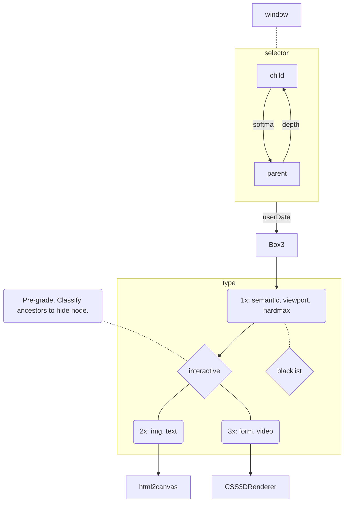

# mpos-precept
Imposter layout to represent DOM rects as THREE bounds.

### Process

### structure 
- `blacklist` (block) -- `.ignore,style,script,link,meta,base,keygen,canvas[data-engine],param,source,track,area,br,wbr`
- `whitelist` (allow) -- `div,span,main,section,article,nav,header,footer,aside,figure,details,li,ul,ol`
### composite
- `html2canvas` (legible) -- `canvas,img,svg,h1,h2,h3,h4,h5,h6,p,li,ul,ol,dt,dd`
- `CSS3DRenderer` (interactive) -- `iframe,frame,embed,object,table,form,details,video,audio`
- `mixed-content` (test resource) -- `canvas,svg,object,embed,audio`
- `dimensions` (track, crash) -- `1 > n < 3840`
