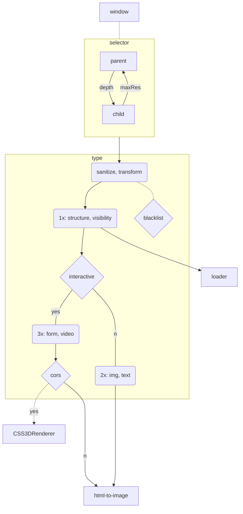

# mpos-precept
Imposter DOM rects in THREE. Synthetic event dispatch.

### Usage
```js
// Initialize containers and EventListeners
const proxy = { scene: scene, camera: camera, renderer: renderer }
mpos.init( /*proxy*/ )

// Add element (and children) to scene
const opts = {
  grade: null,
  depth: 32,
  parse: function( comment ){ /*data*/ }
}
mpos.mod.add( 'main', opts )
```

### Tools
```js
const rect = mpos.fnVar( 'find', '123', {} )
const deep = mpos.fnVar( 'march', '#host', {} )
const link = mpos.fnVar( 'chain', '#host', { count: 8, symbol: 'last' } )
```

### Features
- DOM tree structure is graded for media types:
  - Tags allow user to specify node usage. Elements may be ignored, loaded as paths, or updated every frame.
  - Loader supports/converts media: OpenCV, GIF, MP4, JSON, CSS3D.
  - Texture atlas sets tiered cell area. Interface shows element visibility.
- Sync queue frame:
  - inPolar: Limit visible to user viewport
  - css: Styles propagate (matrix, pseudo) for event synthesis
  - time: FPS cues optimize performance
  - differ: Detect active features and reduce frame updates
  - toSVG: Options qualify diverse metadata

## Grade

