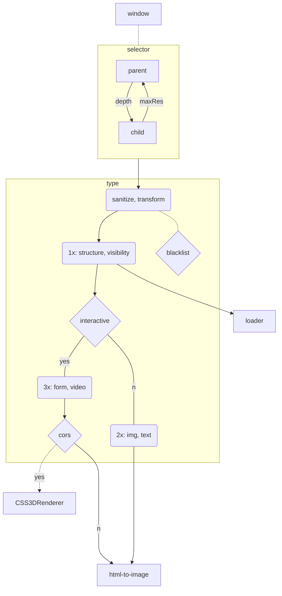

# mpos-precept
Imposter DOM rects in THREE
```js
// Initialize containers and EventListeners
const proxy = { scene: scene, camera: camera, renderer: renderer }
mpos.init( /*proxy*/ )

// Add element (and children) to scene
const opts = {
  grade: null,
  depth: 32,
  parse: function( comment ){ /*data*/ }
}
mpos.mod.add( 'main', opts )
```

### tools
```js
const rect = mpos.fnVar('find', '123', {})
const deep = mpos.fnVar('march', '#host', {})
const nest = mpos.fnVar('chain', '#host', { count: 8, symbol: 'last' })
```

### grade

### applications
- menus: runtime, dynamic, translate, filesize, outsource, mixed-media
- sentiment analysis: simulate, augment, local
- advertise: immersive, context-aware
- game: environment, prototype
- test suite: comps, spec sheet
