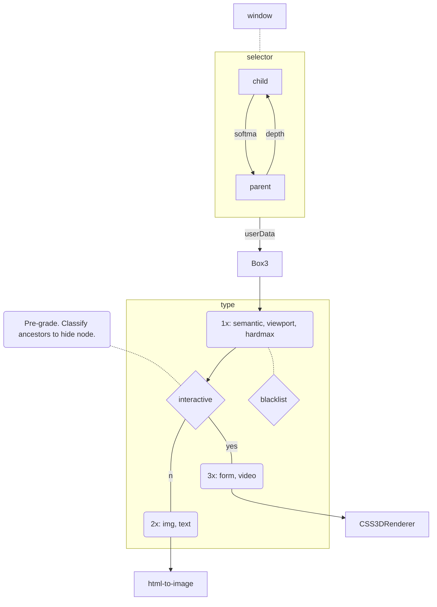

# mpos-precept
Imposter layout to represent DOM rects as THREE bounds.

### Process

### structure 
- `allow` (whitelist) -- `.allow,div,main,section,article,nav,header,footer,aside,tbody,tr,th,td,li,ul,ol,menu,figure,address`
- `block` (blacklist) -- `.block,canvas[data-engine],head,style,script,link,meta,param,map,br,wbr,template`
### interactive
- `native` (CSS3DRenderer) -- `.native,iframe,frame,embed,object,table,details,form,video,audio,a,dialog`
- `poster` (html-to-image) -- `.poster,.pstr,canvas,img,svg,h1,h2,h3,h4,h5,h6,p,ul,ol,th,td,caption,dt,dd`
