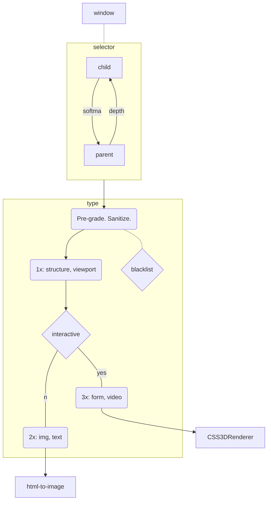

# mpos-precept
Imposter layout to represent DOM rects as THREE bounds.

### Process

|| usage | selector |
| :-- | :-- | :-- |
|| depth ||
| `allow` | whitelist | `.allow, div, main, section, article, nav, header, footer, aside, tbody, tr, th, td, li, ul, ol, menu, figure, address` |
| `block` | blacklist | `.block, canvas[data-engine~='three.js'], head, style, script, link, meta, applet, param, map, br, wbr, template` |
|| quality ||
| `native` | CSS3DRenderer | `.native, a, iframe, frame, embed, object, svg, table, details, form, dialog, video, audio[controls]` |
| `poster` | html-to-image | `.poster, .pstr, canvas, picture, img, h1, h2, h3, h4, h5, h6, p, ul, ol, th, td, caption, dt, dd` |
| `native3d` | environment | `model-viewer, a-scene, babylon, three-d-viewer, #stl_cont, #root, .sketchfab-embed-wrapper, StandardReality` |
