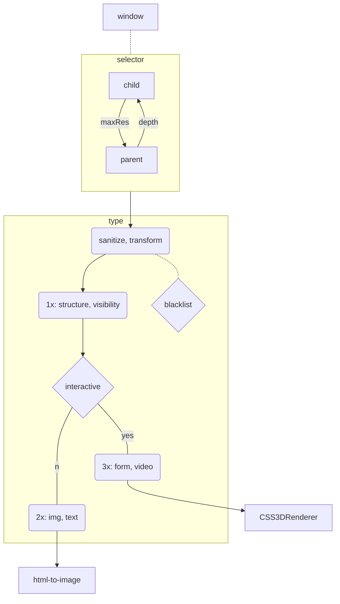

# mpos-precept
Imposter DOM rects in THREE:
```js
mpos.dom( 'aside#form', 16 )
```
The result can reflect updates from source.
### Process

```mermaid
flowchart TB

window-.-selector
subgraph selector
 direction TB
 child--maxRes-->parent
 parent--depth-->child
end

grade("sanitize, transform")
selector-->grade-->a

subgraph type
  direction TB
  a("1x: structure, visibility")
  grade-.-tag{blacklist}
  a-->b{interactive}
  b--no---poster("2x: img, text")
  b--yes---native("3x: form, video")
end

poster-->html-to-image
native-->CSS3DRenderer
```
