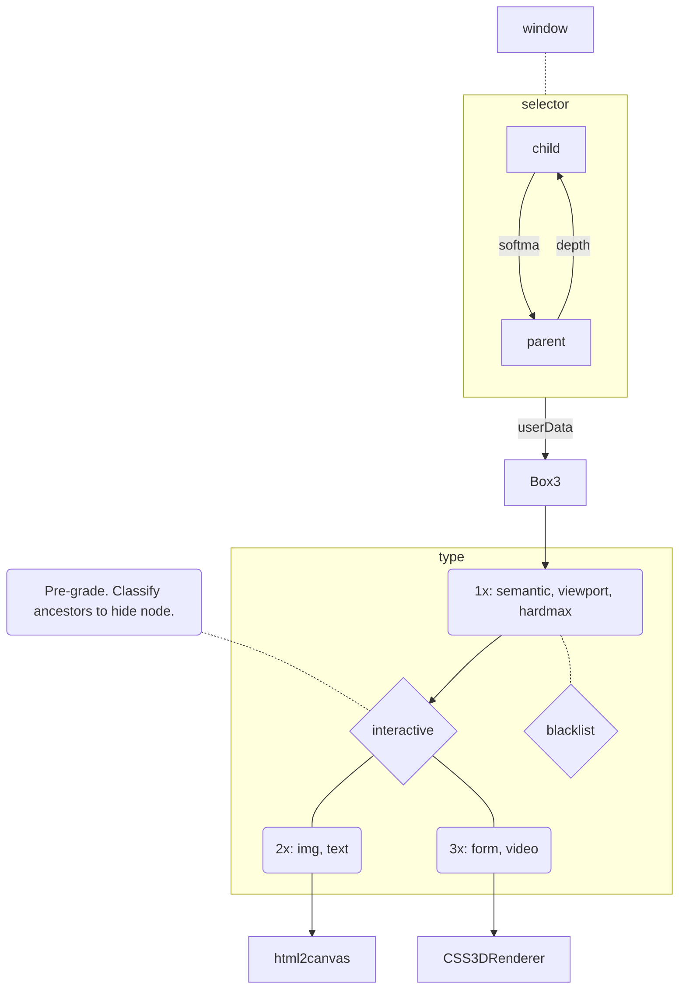

# mpos-precept
Imposter layout to represent DOM rects as THREE bounds.

### Process

### lists
- `blacklist` () -- `.ignore,style,script,link,meta,base,keygen,canvas[data-engine],param,source,track,area,br,wbr`
- `whitelist` (semantic) -- `div,main,section,article,header,footer,aside,table,details,form,ul,ol,li`
- `html2canvas` (legible) -- `img,svg,h1,h2,h3,p,li,ul,ol`
- `CSS3DRenderer` (interactive) -- `iframe,frame,embed,object,table,form,video,audio`
