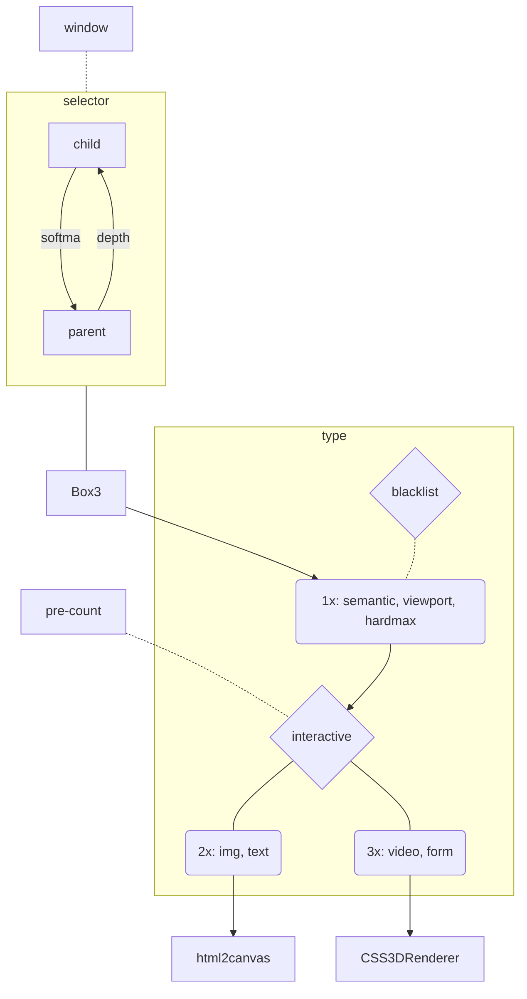

# mpos-precept
Imposter layout to represent DOM rects as THREE bounds.

### Process

```mermaid
flowchart TB

window-.-selector
subgraph selector
 direction TB
 child--softmax-->parent
 parent--depth-->child
end

pre-count-.-b
selector---Box3-->a


subgraph type
  direction TB
  tag{blacklist}-.-a
  a("1x: semantic, viewport, hardmax")
  a-->b{interactive}
  b---canvas("2x: img, text")
  b---css3d("3x: video, form")
end

canvas-->html2canvas
css3d-->CSS3DRenderer
```
